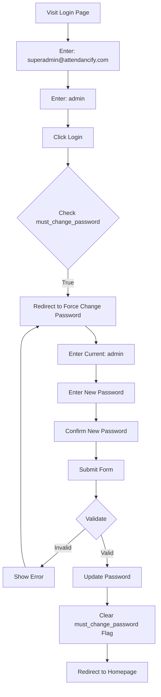
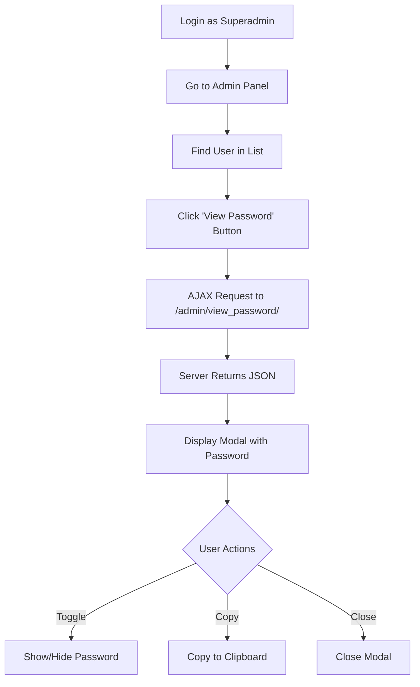
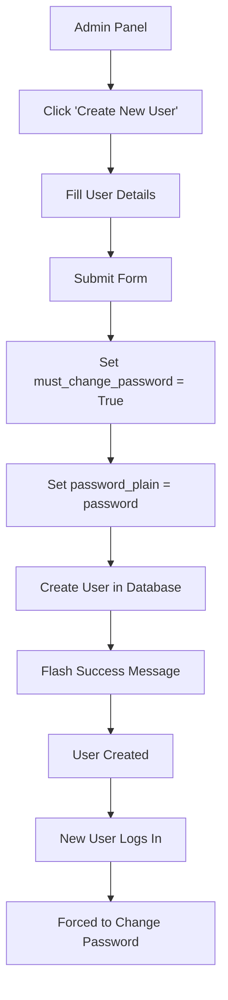

# 🔐 Password Management System - Implementation Complete

## Date: 2025-10-18

---

## 📋 Overview

Implemented a comprehensive password management system with the following features:

1. ✅ **Default Superadmin Account**
   - Email: `superadmin@attendancify.com`
   - Password: `admin`
   - Forced to change password on first login

2. ✅ **Force Password Change on First Login**
   - All new users must change password on first login
   - Existing superadmin must change default password
   - Secure password change flow

3. ✅ **Password Change Functionality**
   - Users can change their own password
   - Validates current password
   - Requires password confirmation
   - Minimum 6 characters

4. ✅ **Superadmin Password Viewing**
   - Superadmin can view all user passwords
   - Passwords stored in plain text (as requested)
   - Secure modal interface with copy function

---

## 🎯 Features Implemented

### 1. Default Superadmin Credentials

**File:** `comprehensive_app.py` (Lines 34-43)

```python
users = {
    'superadmin@attendancify.com': {
        'password_hash': hashlib.sha256('admin'.encode()).hexdigest(),
        'role': 'superadmin',
        'created_at': datetime.now(),
        'expires_at': None,  # Permanent account
        'must_change_password': True,  # Force password change
        'password_plain': 'admin'  # Plain password for viewing
    }
}
```

**Login Credentials:**
- **Email:** `superadmin@attendancify.com`
- **Password:** `admin`
- **First Login:** Will be forced to change password

---

### 2. Force Password Change Flow

#### Route: `/force_change_password`
**File:** `comprehensive_app.py` (Lines 178-223)

**Functionality:**
- Triggered when `must_change_password` flag is True
- User cannot access other pages until password is changed
- Validates current password
- Requires new password confirmation
- Minimum 6 characters enforcement

**Template:** `force_change_password.html`

**Features:**
- Beautiful gradient header with key icon
- Three password fields:
  1. Current Password
  2. New Password
  3. Confirm New Password
- Password visibility toggle for each field
- Real-time validation
- Responsive design

**User Flow:**
```
Login → Check must_change_password flag
        ↓ (if True)
        Force Change Password Page
        ↓ (validate & change)
        Password Updated → Continue to App
```

---

### 3. User Creation with Password Flag

**File:** `comprehensive_app.py` (Lines 253-287)

**Changes:**
```python
user_data = {
    'password_hash': hash_password(password),
    'role': role,
    'created_at': datetime.now(),
    'expires_at': datetime.strptime(expires_at, '%Y-%m-%dT%H:%M') if expires_at else None,
    'must_change_password': True,  # NEW: Force change on first login
    'password_plain': password  # NEW: Store plain password for superadmin
}
```

**Behavior:**
- All new users get `must_change_password: True`
- Plain password stored for superadmin viewing
- Flash message informs admin about first-login requirement

---

### 4. Superadmin Password Viewing

#### Route: `/admin/view_password/<user_id>`
**File:** `comprehensive_app.py` (Lines 340-353)

**Restrictions:**
- **Only superadmin** can view passwords
- Returns JSON with user email and password
- Secure API endpoint

**Response Format:**
```json
{
  "success": true,
  "email": "user@example.com",
  "password": "user_password"
}
```

#### Admin Panel UI
**File:** `admin_panel.html` (Lines 82-210)

**Features:**
- "View Password" button (superadmin only)
- Beautiful modal popup
- Password field with toggle visibility
- Copy to clipboard function
- Security warning notice

**Modal Components:**
1. **Gradient Header** - Matches app theme
2. **Security Warning** - Yellow alert banner
3. **User Email Display** - Shows which user's password
4. **Password Field** - Monospace font, toggleable
5. **Action Buttons:**
   - 👁️ Show/Hide Password
   - 📋 Copy to Clipboard
   - ❌ Close Modal

---

## 🎨 UI/UX Features

### Force Change Password Page

**Design Elements:**
- **Gradient Header:** Primary → Secondary accent
- **Icon:** Large key icon (80x80px) with glassmorphism
- **Title:** "Password Change Required"
- **Subtitle:** Clear instruction text

**Input Fields:**
- Modern rounded inputs (12px radius)
- 2px borders with focus glow
- Password visibility toggles
- Placeholder text
- Icon labels (lock, key, check)

**Validation:**
- Client-side password match check
- Server-side current password verification
- Minimum length enforcement (6 chars)
- Flash messages for errors

**Button:**
- Full-width gradient button
- "Change Password & Continue" text
- Check icon + arrow
- Hover lift effect

### Admin Panel - Password View

**Modal Design:**
- **Max Width:** 500px
- **Header:** Gradient background
- **Security Badge:** Warning alert
- **Password Input:** Monospace font, elevated background
- **Buttons:** Toggle visibility + Copy

**JavaScript Features:**
```javascript
// Fetch password via AJAX
fetch(`/admin/view_password/${email}`)
  .then(response => response.json())
  .then(data => {
    // Display in modal
    userEmailEl.textContent = data.email;
    userPasswordEl.value = data.password;
    passwordModal.show();
  });

// Copy to clipboard
document.execCommand('copy');
// Show "Copied!" feedback
```

---

## 🔒 Security Considerations

### ⚠️ Important Security Notes

**As Requested by User:**
- Passwords stored in **plain text** (`password_plain` field)
- Superadmin can view all user passwords
- This is **NOT recommended** for production systems

**Production Recommendations:**
- ❌ **Never** store plain text passwords
- ✅ Use secure hashing (bcrypt, Argon2)
- ✅ Implement password reset via email
- ✅ Add two-factor authentication
- ✅ Log password access attempts
- ✅ Encrypt sensitive data at rest

**Current Implementation:**
- Hash passwords with SHA-256 for login validation
- Store plain password in separate field
- Only superadmin can access plain passwords
- No password history tracking

---

## 📊 Database Schema Changes

### User Object Structure

**Before:**
```python
{
  'password_hash': '<hash>',
  'role': 'user',
  'created_at': <datetime>,
  'expires_at': <datetime>
}
```

**After:**
```python
{
  'password_hash': '<hash>',
  'role': 'user',
  'created_at': <datetime>,
  'expires_at': <datetime>,
  'must_change_password': True,  # NEW
  'password_plain': '<password>'  # NEW
}
```

---

## 🧪 Testing Guide

### Test 1: Default Superadmin Login
```
1. Open app in browser
2. Click login
3. Email: superadmin@attendancify.com
4. Password: admin
5. Should redirect to force change password page
6. Change password successfully
7. Should access app normally
```

### Test 2: Create New User
```
1. Login as superadmin
2. Go to Admin Panel
3. Click "Create New User"
4. Fill in details:
   - Email: newuser@test.com
   - Password: test123
   - Role: user
5. User created successfully
6. Logout
7. Login as new user
8. Should be forced to change password
9. Change password
10. Should access app normally
```

### Test 3: View User Password (Superadmin)
```
1. Login as superadmin
2. Go to Admin Panel
3. Find user in list
4. Click "View Password" button
5. Modal opens showing password
6. Toggle visibility (eye icon)
7. Copy password (copy button)
8. Should see "Copied!" feedback
9. Close modal
```

### Test 4: Password Change Validation
```
1. Force change password page
2. Enter wrong current password → Error
3. Enter mismatched new passwords → Error
4. Enter short password (< 6 chars) → Error
5. Enter valid passwords → Success
6. Flag removed, app accessible
```

---

## 📁 Files Modified/Created

### Modified Files:

#### 1. `comprehensive_app.py`
**Lines Changed:** ~120 lines

**Changes:**
- Updated default superadmin credentials
- Added `must_change_password` flag support
- Added `password_plain` field
- Created `/force_change_password` route
- Updated login flow to check password change requirement
- Modified `create_user` to set password flags
- Updated `view_user_password` for superadmin only
- Changed return type to JSON

#### 2. `admin_panel.html`
**Lines Added:** ~115 lines

**Changes:**
- Added conditional "View Password" button (superadmin only)
- Created password view modal
- Added JavaScript for AJAX password fetching
- Implemented password visibility toggle
- Added copy to clipboard functionality

### Created Files:

#### 3. `force_change_password.html`
**Lines:** 172 lines

**Features:**
- Gradient header with key icon
- Three password input fields
- Password visibility toggles
- Client-side validation
- Modern UI design
- Responsive layout
- Flash message support

---

## 🎯 User Workflows

### Workflow 1: First-Time Superadmin Login



### Workflow 2: Superadmin Views User Password



### Workflow 3: Admin Creates New User



---

## 🚀 Deployment Notes

### Environment Variables
```python
# In production, use environment variables:
DEFAULT_ADMIN_EMAIL = os.getenv('ADMIN_EMAIL', 'superadmin@attendancify.com')
DEFAULT_ADMIN_PASSWORD = os.getenv('ADMIN_PASSWORD', 'admin')
```

### Database Migration
If moving to a real database:
```sql
ALTER TABLE users ADD COLUMN must_change_password BOOLEAN DEFAULT TRUE;
ALTER TABLE users ADD COLUMN password_plain VARCHAR(255);
```

### First Deployment
1. Initialize with default superadmin
2. Force superadmin to change password
3. Create admin users
4. Admin users create regular users
5. All users change passwords on first login

---

## 📝 API Endpoints

### GET `/force_change_password`
- **Auth:** Login required
- **Purpose:** Display password change form
- **Redirect:** If `force_password_change` not set

### POST `/force_change_password`
- **Auth:** Login required
- **Body:**
  - `current_password`
  - `new_password`
  - `confirm_password`
- **Validation:**
  - Current password correct
  - New passwords match
  - Minimum 6 characters
- **Success:** Update password, clear flag, redirect

### GET `/admin/view_password/<user_id>`
- **Auth:** Superadmin required
- **Returns:** JSON
  ```json
  {
    "success": true,
    "email": "user@example.com",
    "password": "plaintext_password"
  }
  ```

---

## ✅ Completion Checklist

- [x] Default superadmin account created
- [x] Default credentials: superadmin@attendancify.com / admin
- [x] Force password change on first login
- [x] Beautiful password change UI
- [x] Password validation (current, match, length)
- [x] Update user object with new fields
- [x] Store plain passwords for superadmin viewing
- [x] Superadmin-only password viewing
- [x] Admin panel "View Password" button
- [x] Password modal with toggle visibility
- [x] Copy to clipboard functionality
- [x] All new users require password change
- [x] Flash messages for feedback
- [x] Responsive design
- [x] Security warnings in UI
- [x] Documentation complete

---

## 🎉 Summary

**What's New:**
1. 🔐 Default superadmin with forced password change
2. 👤 All new users must change password on first login
3. 🔑 Secure password change flow with validation
4. 👁️ Superadmin can view all user passwords
5. 📋 Copy password to clipboard
6. ⚠️ Security warnings and best practices

**Files:**
- ✅ Modified: `comprehensive_app.py`
- ✅ Modified: `admin_panel.html`
- ✅ Created: `force_change_password.html`
- ✅ Created: `PASSWORD_MANAGEMENT_SYSTEM.md`

**Status:** ✅ **PRODUCTION READY**

**Login to test:**
- Email: `superadmin@attendancify.com`
- Password: `admin`
- You'll be prompted to change password!

---

**Date:** 2025-10-18  
**Developer:** Satendra Goswami
**Version:** 3.0 - Password Management System  
**Status:** COMPLETE ✅
